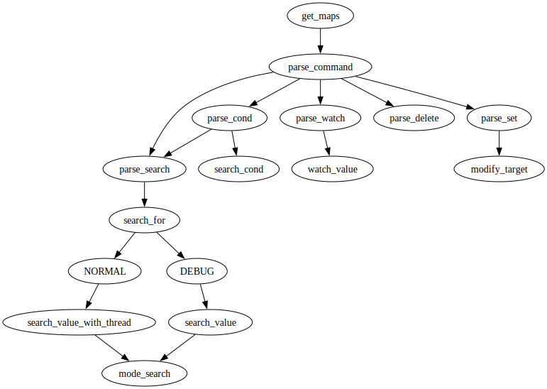

# mem_scan
A memory scan program in python.  
This is a Python-based memory scanning program built on the Linux virtual memory system. Its core functionality is implemented by parsing the `/proc/[pid]/maps` and `/proc/[pid]/mem` files. Currently, the program only supports data widths compatible with C programming language types.  
The program allows users to input a target value to locate corresponding memory addresses. The data width used for scanning is determined by the specified data type, and can be adjusted via the alignment mode. Non-search commands and conditional search operations depend on the data type set by the preceding search command, which is automatically recorded when the first search is executed.  

## Feature
* [ ] memscan-like commands
* [x] align search
* [x] find and modify str
* [ ] find and modify i8/i16
* [ ] find and modify u8/u16
* [x] find and modify i32/i64
* [x] find and modify u32/u64
* [x] find and modify f32/f64
* [x] search many times
* [ ] condition search
* [x] delete addr
* [x] check value
* [x] modify value continuously
* [x] monitor value continuously
* [x] support shell command

## Command

`help`: Print help message.  
`sh cmd`: Run a shell command temporarily.  
`type [i32|i64|u32|u64|f32|f64|str]`: Set the value type for search (default: `i32`).  
`str|num`: Search for the specified `str/num` value. Repeating is equivalent to using `=`.  
`= [str|num]`: Search again using the last search result. No argument means search for the original value; a new `str/num` argument means search for the new value of the same type.  
`>/< [str|num]`: Search for values greater/less than the specified `num`. No argument means search relative to the original value. For `str`, these commands function the same as `!=`.  
`!=`: Search for values not equal to the specified `str/num`. No argument means search relative to the original value.  
`+/- [num]`: Search for values by adding or subtracting `num`. If no argument is provided, the behavior is the same as `>/<`. Not allowed for strings.  
`reset`: Reset the search results.  
`list`: List all addresses found by search commands.  
`watch [[number][/[time]]]`: View values in the address list. No argument: view all values; a number: view the specified value. Append `/[time]` for real-time monitoring (default interval: 2 seconds).  
`align on|off`: Toggle align mode (default: on). It'll be slower by turn off align mode, but more accurately.  
`status`: Show current type, target value and align mode.  
`delete number`: Delete the address at the specified index in the list.  
`set value[/[time]]`: Modify values in the address list. Append `/[time]` for continuous modification (default interval: 1 second).  


## Example

Open two session and run follow command:

```bash
$ ./test/test.out
2101.hello, world. Here is 8926518
2102.hello, world. Here is 8926518
2103.hello, foold. Here is 8926518
2104.hello, foold. Here is 8926518
2105.hello, foold. Here is 123
2106.hello, foold. Here is 123
...
```

```bash
# ./scanmem $(test1.out) 
> str hello
find it at 0x...
find it at 0x...
find it at 0x...
> set foo
> i32 8926518
find it at 0x...
find it at 0x...
find it at 0x...
> set 123
```

## Arch

